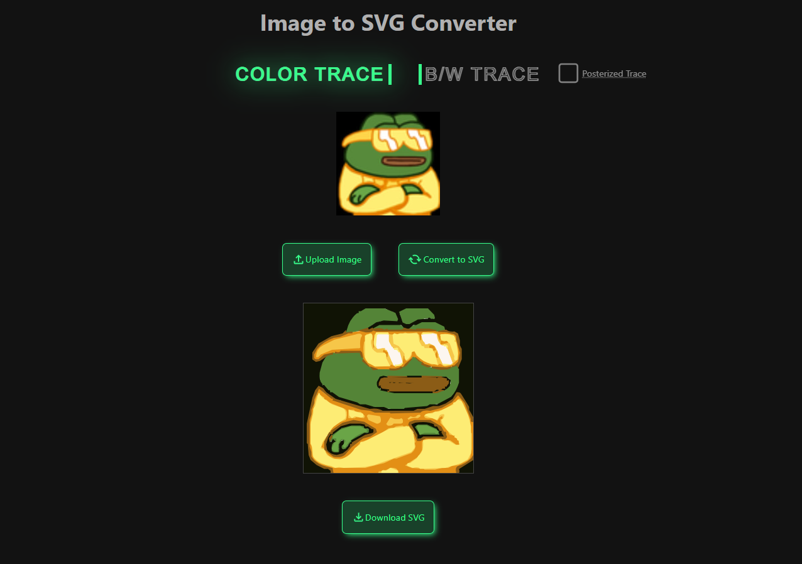

# 🖼️ SVG Image Tracer

Convert raster images (JPG, PNG, etc.) into scalable SVG vectors using different tracing algorithms — all in your browser.

 <!-- Optional: replace with actual screenshot path -->

---

## 🚀 Features

- 📤 Upload any image format (JPEG, PNG, WebP, etc.)
- 🎨 Choose between different SVG tracing methods:
  - **Color Trace (ImageTracer.js)** – Keeps original colors, fast but less precise.
  - **B/W Trace (Potrace)** – Monochrome, higher accuracy.
  - **Posterized Trace (Enhanced Potrace)** – Monochrome with grayscale-like results. Most precise.
- 🔁 Live SVG preview before download
- 💾 Download your vector as an `.svg` file

---

## 🧪 Conversion Styles

| Mode             | Color Support | Precision | Best Use Case                     |
|------------------|---------------|-----------|-----------------------------------|
| **Color Trace**  | ✅             | ⭐⭐        | Posters, logos with many colors   |
| **B/W Trace**    | ❌             | ⭐⭐⭐      | Stamps, logos with sharp contrast |
| **Posterized**   | ❌ (Mono + Shades) | ⭐⭐⭐⭐ | Hand-drawn sketches, high detail |

---

## 📦 Getting Started

1. **Clone the repo**  
   ```bash
   git clone https://github.com/hardcoreseb/svg-image-tracer.git

2. **Install dependencies**
    ```bash
    npm install

3. **Run the app**
    ```bash
    ng serve

4. **Open `http://localhost:4200` in your browser**

## 📂 How to Use

1. Upload an image

2. Select a tracing method

3. Click "Convert"

4. Preview the SVG result

5. Click "Download" to save the SVG

## 💡 Tech Stack

- Angular
- [ImageTracer.js](https://github.com/jankovicsandras/imagetracerjs)
- [Potrace](https://www.npmjs.com/package/potrace)
- SCSS

## 📸 Screenshots

| Original Image | ImageTracer SVG | Potrace SVG | Posterized Potrace SVG |
|----------------|------------------|-------------|--------------------------|
|  |  |  |  |

> _Above: Comparison of the same image using the different conversion methods._


## 📄 License
MIT — feel free to use and modify it!